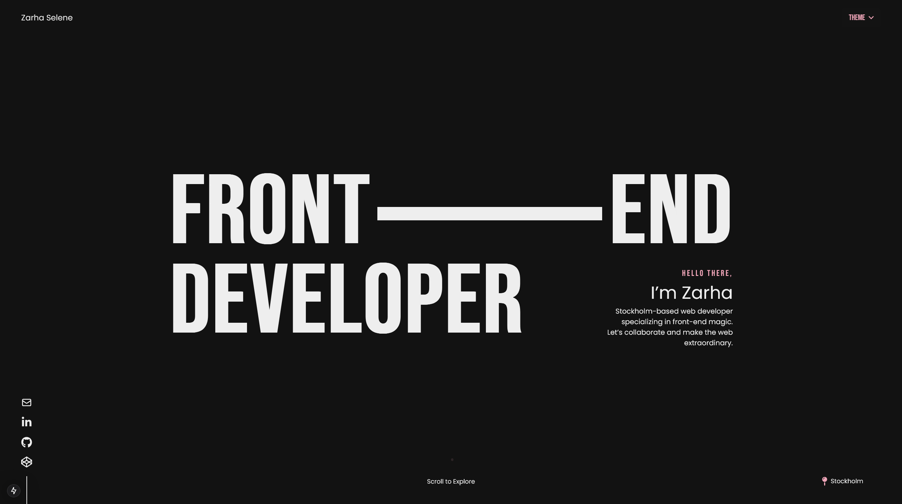

# Portfolio 

## 📝 Overview
This is my personal portfolio project showcasing my skills and projects as a web developer. 
The portfolio is built using Next.js and styled with Tailwind CSS.

## 🌐 Live Preview
Check out the live preview of my portfolio [Live Preview](https://zarhaselene-portfolio.netlify.app/). 
The portfolio features my projects, skills, experience, and education, presented with smooth animations and an intuitive UI.

## 🌸 Screenshot

## ✨ Features

### 🎨 Design & Experience
- 📱 **Fully Responsive Design**: Responsive design for all devices
- 🌓 **Dark Mode Support**: Theme switching
- 🚀 **Smooth Animations**: Powered by Framer Motion
- ⚡ **Optimized Performance**: With Next.js

## 🛠 Technologies Used

| Technology | Purpose | 
|-----------|---------|
| 🔹 **Next.js** | Robust React framework for production |
| 🔹 **React** | Flexible component-based UI library |
| 🔹 **Tailwind CSS** | Utility-first CSS framework |
| 🔹 **Framer Motion** | Animations and transitions |
| 🔹 **Google Fonts** | Typography |

