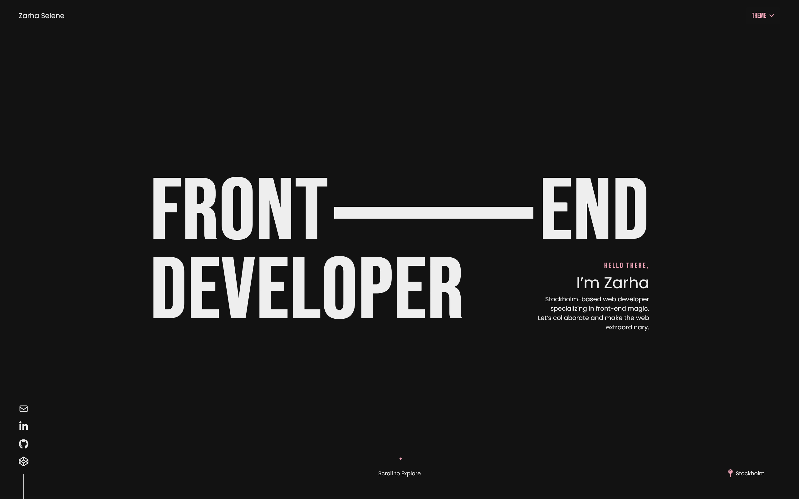

# Portfolio

## 📝 Overview

Welcome to my personal portfolio! This project highlights my skills, experience, and projects as a web developer. It is built with Next.js and styled using Tailwind CSS, ensuring a modern and responsive design.

## 🌐 Live Preview

Explore the live version of my portfolio here: [Live Preview](https://zarhaselene.com). The site features an intuitive user interface, smooth animations, and detailed sections about my work and background.

## 🌸 Screenshot

## ✨ Features

### 🎨 Design & Experience

- 📱 **Responsive Design**: Optimized for all screen sizes and devices.
- 🌓 **Dark Mode**: Seamless theme switching for better user experience.
- 🚀 **Smooth Animations**: Enhanced with Framer Motion for dynamic transitions.
- ⚡ **High Performance**: Built with Next.js for fast and efficient loading.

## 🛠 Technologies Used

| Technology           | Purpose                               |
| -------------------- | ------------------------------------- |
| 🔹 **Next.js**       | A powerful React framework for production-ready apps. |
| 🔹 **React**         | Component-based library for building user interfaces. |
| 🔹 **Tailwind CSS**  | Utility-first CSS framework for rapid styling. |
| 🔹 **Framer Motion** | Library for animations and transitions. |
| 🔹 **EmailJS**       | Service for integrating email functionality. |
| 🔹 **Google Fonts**  | Custom typography for a polished look. |
